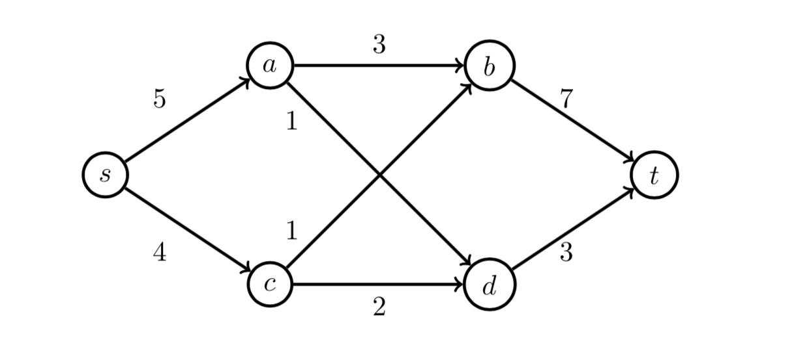

# A

## i

It's false. The counter example is just the graph of problem 4.



In this graph, the edge `s->a` is a flow-stopper. The maxflow will reduce from 7 to 3 if we delete `s->a`. Though, it's not in any min-cut. The current min-cuts are `a->b, a->d, c->d, c->b` or `a-> c->b, d->t`. Neither contains the edge `s->a`.

## ii

Suppose `e` is a edge in a s-t min-cut, let us say min-cut (A,B), and it's not a flow-stopper. Therefore, removing `e` from graph will not make the max-flow shrink. It means there is a min-cut other than (A, B), which its value is less than the value of (A, B). Though, it's impossible. the value of (A, B) must shrink due to this removal.
 

# B

## Algorithm

```
isStopper(G, F, e) {
    if (e has 0 flow in F) {
        return false
    }
    Gr = compute the residual graph by G and F.
    delete the e from Gr and update values.
    f = e's flow in F
    v = e's target vertex
    ag = 0
    while (exist an augmented path in Gr from source to v) {
        ag += augmented path flow value
        update Gr
        if (ag >= f) {
            return false
        }
    }
    return true
}
```

## Time Complexity

The algorithm will first compute the residual graph from G and F by iterating each edge.

The algorithm need to keep find the augmented path from source to v, which takes E times. Since each augmented path found may at least increase ag by 1, the loop will terminate in f, or denoted as $c_{e'}$, times.

Therefore, the time complexity of it is $O(E \cdot c_{e'})$.

## Space Complexity

The algorithm requires an extra residual graph. Therefore, the space complexity is $O(E)$.

## Proof for Correctness

The algorithm directly delete the edge from graph and try to check if it's possible to pump more flow from source to the target of the e. The algorithm will get the result if there is enough flow to fill the deletion flow. Or, if the augmented path cannot fill the flow, the algorithm will return true as the deletion will cause the new augmeneted path sum less than current case.   
