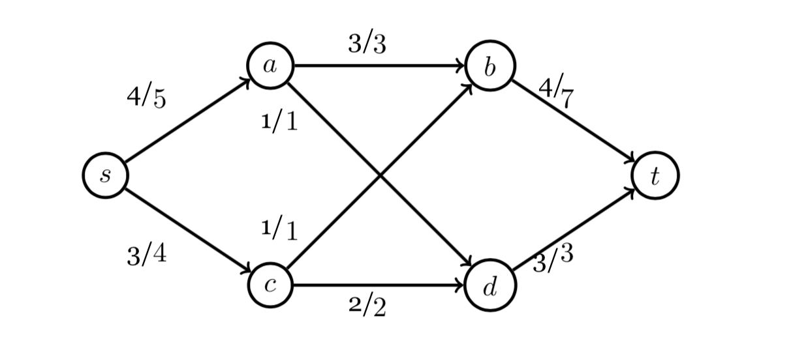
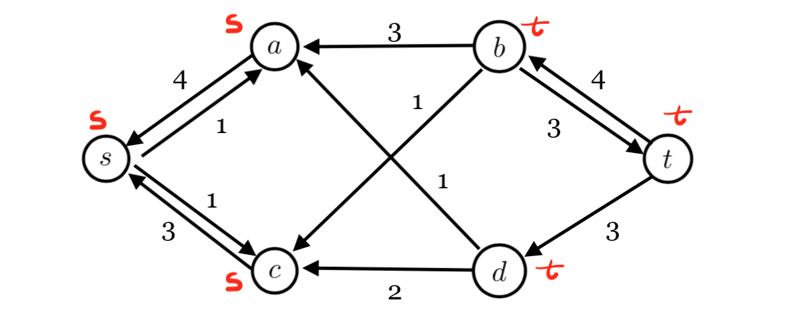
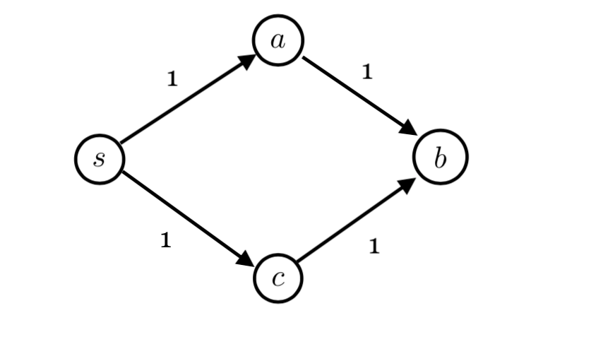

# A

The maximum flow from s to t is 7. The edges `a->b, a->d, c->b, c->d` form a min-cut from s to t.

The flow on every edge in maxflow is shown in this graph: 




# B 



The vertices marked with red symbol `s`, are the vertices reachable from s.

The vertices marked with red symbol `t`, are the vertices reachable from t.

# C

The edges `a->b, c->b` are the bottleneck of this graph.

# D




# E

## Algorithm

```
allBottleneck(G) {
    Ford-fulkerson(G)
    Gr <- the residual graph of G produced by last ford-filkerson algorithm
    Lsrc <- new empty list
    Lsik <- new empty list
    for (each vertex v in G) {
        if (source can reach v in Gr)
            add v to Lsrc
        else if (v can reach sink in Gr)
            add v to Lsik
    }

    Ledge <- new empty list
    for (each v in Lsrc) 
        for (each lv in Lsik) {
            if (v -> lv exist in G) {
                add v->lv to Ledge
            }
        }
    return Ledge
}
```

## Time Complexiy

The algorithm first perform Ford-fulkerson algorithm, which is $O(Ef)$. Then it iterates the vertex of the graph for V times. Each time, it will perform a DFS. Totally, it might take $O^2$ times. Finally, it iterate the collected vertices. Since, the vertices are choosen from the residual graph, the total number of possible vertex in list is V. Therefore, the algorthm will runs for $O(Ef+V^2)$

## Space Complexity

The algorithm takes an array to store the vertices. Also, the Ford-fulkerson algorithm requires an additional graph. So, it takes $O(E)$.

## Proof for Correctness

The algorithm will choose the edges between the vertices that can reach sink or be reached from source in residual graph. If the capacity of these edges increase, it must form a new augmented path. Then if we perform the Ford-fulkerson algorithm, it will choose this new augmented path and increase the total max-flow output.