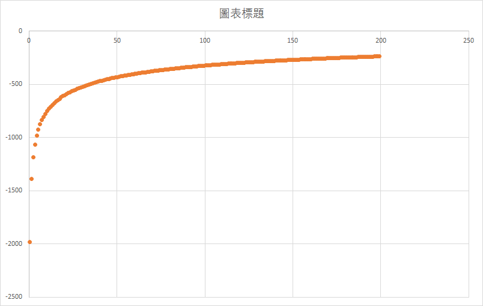

Name: Hongze Xu Hoxu, Yijiong Xu yxu49, Wenqiao Zhu wzhu8

File submitted: HW3_Xu_code.zip,

#2.1

1. 1364 
2. L2-norm = 35.98
3. Accuracy of train set is 0.98
4. Precision = 0.89, Recall = 0.98, F1-measure = 0.93
5. Percision = 0.99, Recall = 0.98, F1-measure = 0.99
6. The confusion matrix is

| 576| 10   |  
| -- | --- | 
| 71 | 3802|

7. Accuracy of test set is 0.95
8. Precision = 0.811, Recall = 0.90, F1-measure = 0.85 for positive. Precision = 0.98, Recall = 0.96, F1-measure = 0.97 for negative.
9.  
| 146| 15  |  
| -- | --- | 
| 34 | 920 |
1. 
2. We can balance the numbers of positve and negative instances to improve the performance.

#2.2

1. 1364 parameters for weights 1 more for bias. (We didn't include the bias to weights array. Therefore they are counted seperated)
2. 
| 144| 17  |  
| -- | --- | 
| 2 | 952 |
3. The logistic regression with bias raises the accuracy. It makes the model could fit the data more tightly, but it might make the model more overfitting. 

#2.3

1. 1364 parameters
2. 
| 147| 14  |  
| -- | --- | 
| 33 | 921 |
1. The test set accuracy increases related to other two methods. Since we try to regularize here, we can fit the model not too overfitting to the train set, and the test set performance then increases. 
2. The L2 Norm in this problem is 26.19. The norm is decreased since the idea of regularization is try to not overfitting, which means we keep the weights of some features really small so the decision boundary will become smoother and more general, so won't overfitting with current dataset.